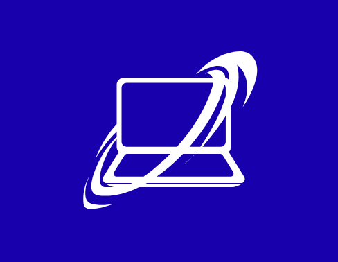
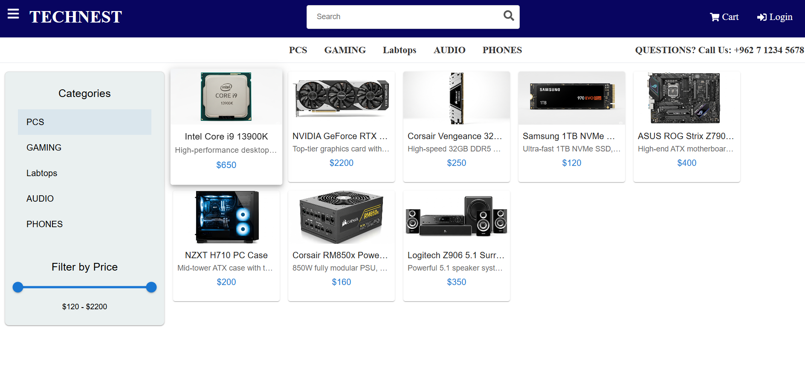
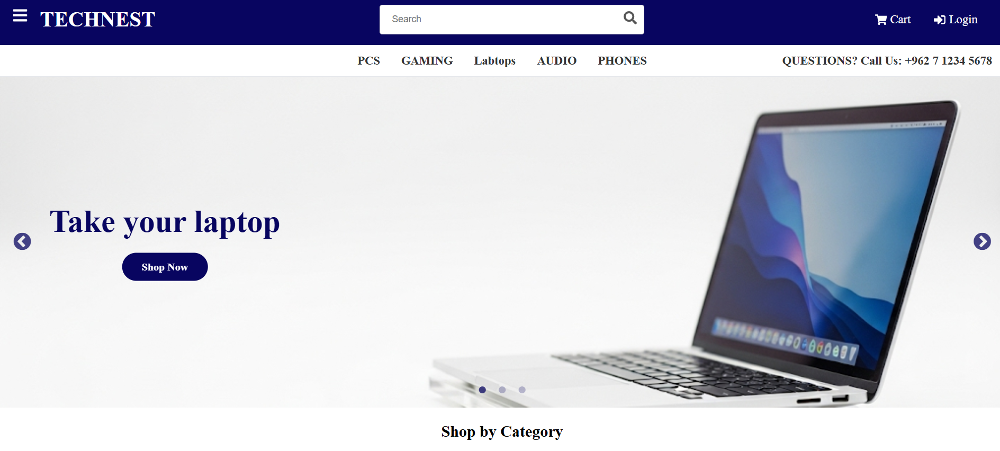
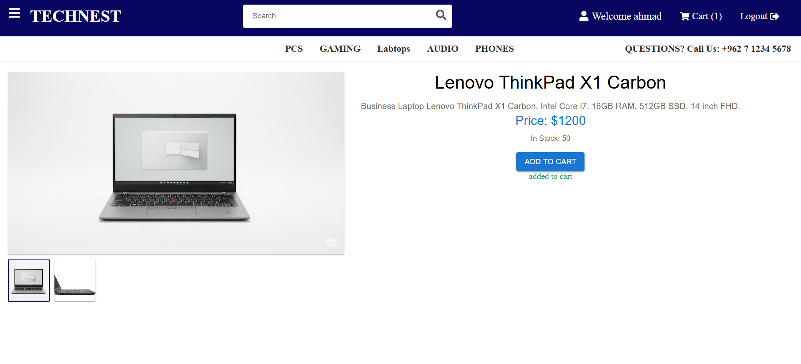
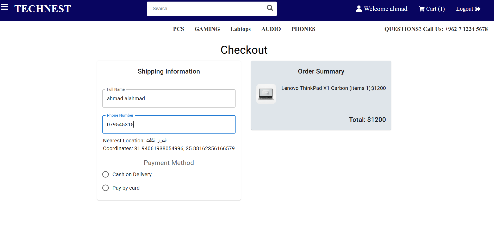
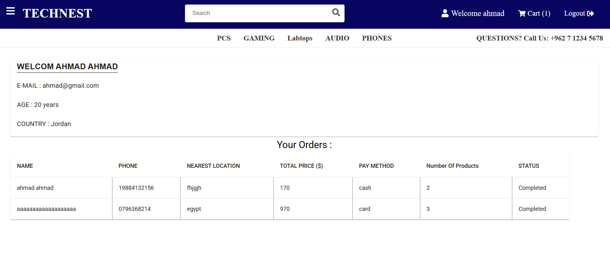
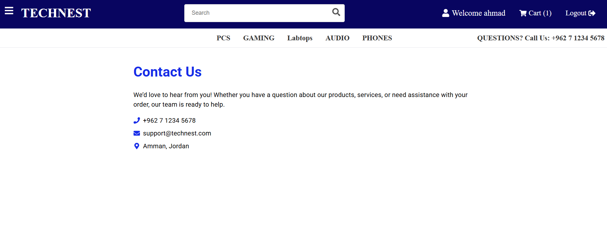
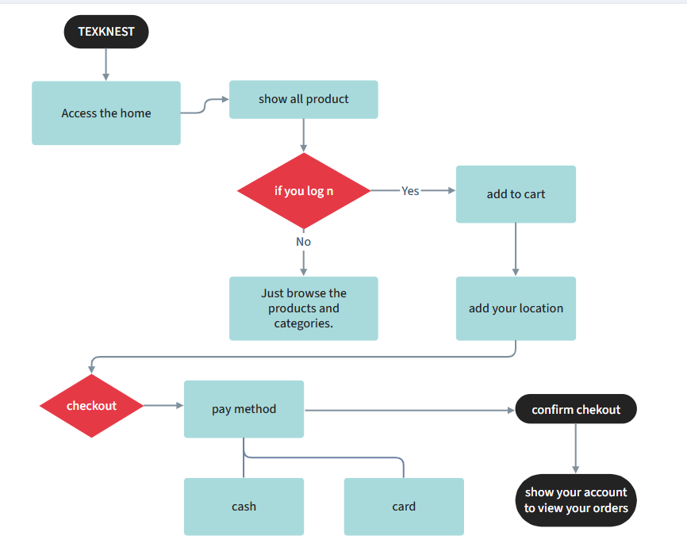

<p align="center">
<a href="https://www.meraki-academy.org" target="_blank" rel="noopener noreferrer">
 
 </a>
</p>

<h3 align="center">TECHNEST
</h3>

---

<p align="center"> An awesome Project to describe README 
    <br> 
<a href=''>Demo</a>
    <br> 
</p>

## 📝 Table of Contents

- [About](#about)
- [Getting Started](#getting_started)
- [Usage](#usage)
- [Built Using](#built_using)
- [User Story](#user_story)
- [Data Flow](#data_flow)
- [Guided By](#guided_by)

## 🧐 About <a name = "about"></a>

Welcome to **TECHNEST**, your trusted destination for the latest and greatest in electronics. We are dedicated to providing high-quality products, exceptional customer service, and unbeatable prices to meet all your technology needs.

From powerful PCs and laptops to smartphones, accessories, and smart home devices, we carefully select every product to ensure it meets our customers’ expectations. Whether you’re a gamer, a student, or a professional, **TECHNEST**0 has the right solution for you.

## 🏁 Getting Started <a name = "getting_started"></a>

These instructions will get you a copy of the project up and running on your local machine for development and testing purposes.

### Prerequisites

- Visual Studio Code follow this <a href='https://code.visualstudio.com/'>link</a> to install.
- Git Bash follow this <a href='https://git-scm.com/'>link</a> to install.
- MongoDB follow this <a href='https://www.mongodb.com/try/download/community'>link</a> to install.
- Node.js follow this <a href='https://nodejs.org/en/download/'>link</a> to install.

### Installing:

1. Clone the repo to your local machine using git bash.

```
git clone https://github.com/C15-YazanHasanat/MERAKI_Academy_Project_4.git
```

2. Install packeges repeat this step in backend and frontend folder

```
npm i
```

3. Run server using git bash inside backend folder

```
npm run dev
```

4. Run application using git bash inside frontend folder(vite)

```
npm run dev
```

Now app ready to use

## 🎈 Usage <a name="usage"></a>

Use this space to show useful examples of how a project can be used. Additional screenshots, code examples and demos work well in this space. You may also link to more resources.

Ex.

- Browse products without registering.  

   

- Use the **Home** page to view featured products and categories.  

  

- Click **Add to Cart** to add products to your cart (requires account registration) 
 

- Checkout and Payment: Complete your purchase using the checkout page.  

  

- User Profile & Orders: Click your name in the navbar to view your profile information and completed orders.

  

- Contact support via the **Contact Us** page. 

   


## ⛏️ Built Using <a name = "built_using"></a>

- [MongoDB](https://www.mongodb.com/) - Database
- [Express JS](https://expressjs.com/) - Server Framework
- [React JS](https://https://reactjs.org/) - Web Framework
- [Node JS](https://nodejs.org/en/) - Server Environment

## User Story <a name = "#user_story"></a>

Your trello board link
<a href='https://trello.com/b/HK0FpRgA/e-commerce-website'>Trello</a>

## Data Flow <a name = "#data_flow"></a>

</a>

## ⚠️ Guided By <a name = "guided_by"></a>

This project is guided by ©️ **[YAZAN HASSANAT](https://www.instagram.com/yazen_hasanat/)**
